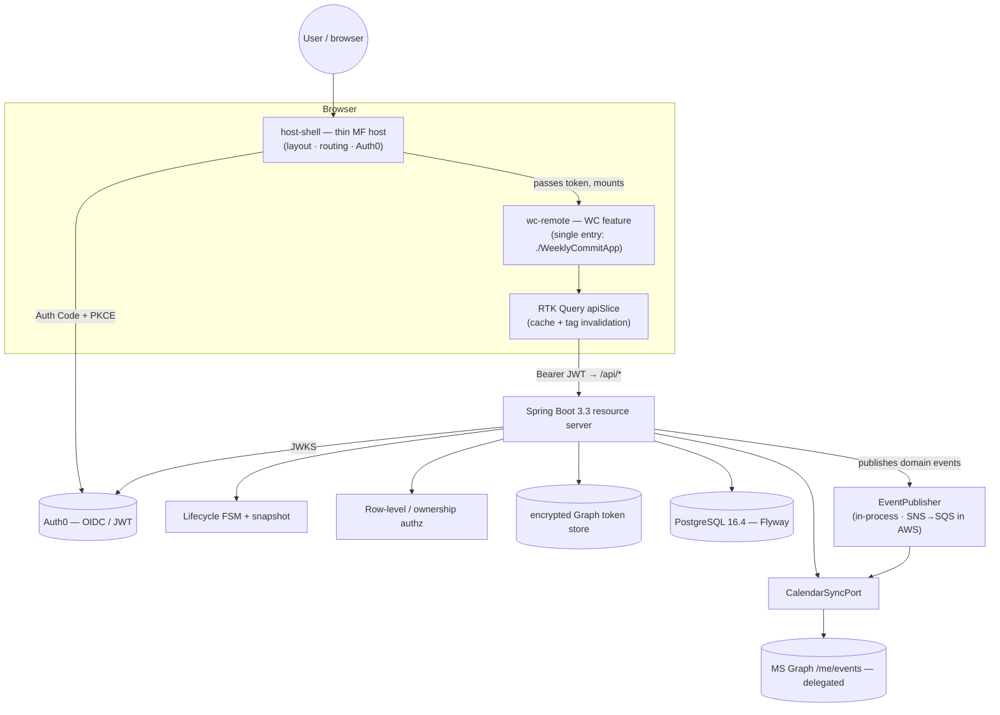

<!-- README.md — top-level orientation for the Weekly Commit Module (Solovis). What it is, how it's
     wired, how to run it locally (standalone or federated), and the full test command matrix that
     produces the TEST RESULTS deliverable. Deep architecture lives in docs/TECHNICAL.md. -->

# Weekly Commit Module (WCM)

A production-quality **weekly-commit module** for Solovis that replaces the 15Five weekly-planning
slice and enforces the missing link between individual weekly work and company strategy. Every
weekly commitment maps to a **Supporting Outcome** in the **RCDO** hierarchy (Rally Cry → Defining
Objective → Outcome → Supporting Outcome), runs a full server-enforced weekly lifecycle, and gives
managers a real-time team roll-up of strategic alignment.

It is built as a **Vite 5 Module Federation remote** (React 18, in an Nx + Yarn-Workspaces-shaped
monorepo) backed by a **Spring Boot 3.3 / Java 21 / PostgreSQL 16.4** API. In production the remote
(`wc-remote`) is loaded by the PA host app; here a thin `host-shell` plays that role so the same
build runs both **standalone** and **host-federated**.

| Area | Stack |
|------|-------|
| Frontend | React 18, Vite 5 + `@module-federation/vite`, Redux Toolkit + **RTK Query**, Flowbite React, Tailwind CSS, TypeScript strict |
| Backend | Spring Boot 3.3.13, Java 21, Spring Data JPA / Hibernate, Flyway, PostgreSQL 16.4 |
| Auth | Auth0 (OAuth2 / RS256 JWT) resource server **+ row-level ownership authz** |
| Integrations | Microsoft Graph (delegated Outlook `/me/events`); SNS → SQS event seam (in-process locally) |
| Tests | Vitest + RTL (FE), JUnit + MockMvc + Testcontainers (BE), Cypress + Cucumber/Gherkin (E2E), Playwright smoke, k6 (stress) |

---

## Deliverables

| Required deliverable | Where it lives |
|---|---|
| **SOURCE CODE** | this repository (`backend/`, `apps/`, `libs/`, `e2e/`, `perf/`) |
| **TECHNICAL DOCUMENTATION** | [docs/TECHNICAL.md](docs/TECHNICAL.md) |
| **DEMO VIDEO** | script in [docs/DEMO_SCRIPT.md](docs/DEMO_SCRIPT.md) |
| **TEST RESULTS** | the [test command matrix](#test-command-matrix-the-test-results-deliverable) below |
| **AI USAGE LOG** | [AI_USAGE.md](AI_USAGE.md) |

---

## Architecture



The host owns Auth0 and passes a `getToken()`/`user` down to the remote; absent a host the remote
self-provides Auth0 so it boots standalone. All data access goes through the RTK Query slice
(`libs/api`) — there is no direct `fetch`/`axios` in app code. The backend is the source of truth for
the lifecycle FSM, the RCDO-link-at-LOCK guard, and every authorization decision.

See **[docs/TECHNICAL.md](docs/TECHNICAL.md)** for the layer-by-layer architecture, data model,
security model, API surface, the Brief Conformance table, and the full testing matrix.

---

## Repository layout

```text
weekly-commit-module/
├── apps/
│   ├── wc-remote/        # the WC MF remote — exposes ./WeeklyCommitApp; all feature screens
│   └── host-shell/       # thin dev host — owns Auth0, loads the remote via Module Federation
├── libs/
│   ├── api/              # RTK Query commitApi + MSW handlers + token provider
│   ├── types/            # shared TS contract types (DTOs, error shapes)
│   └── ui/               # shared primitives (lifecycle badge, RCDO chip, state primitives, sub-nav)
├── backend/              # Spring Boot 3.3 (Java 21, Maven) — com.solovis.wcm.{common,member,rcdo,commit,review,integration,event}
│   └── src/main/resources/db/migration/   # Flyway V1…V8
├── e2e/                  # Cypress + Cucumber/Gherkin features + Playwright smoke + run-e2e.sh
├── perf/                 # k6 stress script + run-stress.sh (the <200ms read NFR check)
├── docs/                 # TECHNICAL.md, DEMO_SCRIPT.md, planning/, setup/
├── docker-compose.yml    # PostgreSQL 16.4
├── .env.example          # copy to .env and fill in Auth0 / Graph / DB values
└── .github/workflows/ci.yml
```

---

## Prerequisites

| Tool | Version | Notes |
|------|---------|-------|
| **JDK** | **21** (Temurin) | Pinned; CI uses Temurin 21. A local `~/.local/wcm-toolchain.env` exports `JAVA_HOME`/`MAVEN_HOME` on the build box — `source` it before `mvn`. |
| **Maven** | 3.9.x | No `mvnw` wrapper is committed; use the system/toolchain `mvn`. |
| **Node** | **20** | Pinned (`engines.node >= 20`). |
| **npm** | 10+ | This repo uses **npm**, not Yarn (see Assumptions in TECHNICAL.md). |
| **Docker** | recent | Postgres, the E2E browser images (Cypress/Playwright), and the k6 image. |

> The brief names Yarn Workspaces; this build uses **npm workspaces** with the same `apps/*` + `libs/*`
> layout (PRD line 77 says you "don't need to replicate" PA's package manager). Nx is kept for the
> task graph and lib resolution. This is documented as a deliberate, low-risk deviation.

---

## Local setup

```bash
# 1. Clone, then create your local env from the template (NEVER commit a real .env).
cp .env.example .env
#    Fill in Auth0 (VITE_AUTH0_* + AUTH0_ISSUER_URI/AUDIENCE) and, for Outlook, the AZURE_* values.
#    A bare boot with EVERYTHING blank still starts — auth/Graph just stay inactive (good for tests).
#    Guided external-service setup: docs/setup/EXTERNAL_SERVICES_SETUP.md.

# 2. Start PostgreSQL 16.4 (host port 5433 → container 5432).
docker compose up -d postgres

# 3. Install frontend deps.
npm ci

# 4. (one-time) make the pinned JDK 21 + Maven visible to your shell, if you use the toolchain env.
source ~/.local/wcm-toolchain.env   # exports JAVA_HOME=…/jdk-21, MAVEN_HOME, PATH
```

---

## Run commands

### Backend (Spring Boot API on :8080)

```bash
# Default boot (Auth0 JWT chain; needs AUTH0_ISSUER_URI to validate real tokens):
DB_URL=jdbc:postgresql://localhost:5433/wcm mvn -f backend/pom.xml spring-boot:run

# Demo boot with the Solovis seed loaded (managers, reports, RCDO tree, sample commits):
DB_URL=jdbc:postgresql://localhost:5433/wcm SPRING_PROFILES_ACTIVE=demo \
  mvn -f backend/pom.xml spring-boot:run

# Hermetic dev/E2E boot — X-Debug-Member header auth (no Auth0 tenant needed) + the seed:
DB_URL=jdbc:postgresql://localhost:5433/wcm SPRING_PROFILES_ACTIVE=e2e,demo \
  mvn -f backend/pom.xml spring-boot:run
```

OpenAPI / Swagger UI: `http://localhost:8080/swagger-ui/index.html` · health: `/actuator/health`.

### Frontend (dev)

```bash
# Standalone — the remote runs by itself (self-provides Auth0), on :4201:
npx nx serve wc-remote          # → http://localhost:4201

# Host + remote (live Module Federation) — the host on :4200 lazy-loads the remote on :4201:
npx nx serve wc-remote          # terminal A — must be up first (serves remoteEntry.js)
npx nx serve host-shell         # terminal B → http://localhost:4200 (host loads the remote)
```

The host proxies `/api/*` to the backend on :8080 (set `WCM_API_TARGET` to override), so RTK Query's
`/api` base reaches the API with no CORS config in dev.

### Build (production / CDN bundle)

```bash
npx nx build wc-remote          # emits the chunked remoteEntry.js (the CDN-delivered MF bundle)
npx nx build host-shell
npm run build                   # build everything (nx run-many -t build)
```

---

## Test command matrix (the TEST RESULTS deliverable)

| Suite | What it covers | Command | Reports |
|-------|----------------|---------|---------|
| **Unit (FE)** | Components, RTK Query slice, shared UI primitives, hooks (RTL + MSW, no backend) | `npx vitest run --coverage` | `coverage/` (HTML) |
| **Unit + API (BE)** | Domain/FSM unit tests **and** MockMvc controller + Testcontainers integration tests (`mvn verify` runs surefire **and** failsafe) | `mvn -f backend/pom.xml verify` | `backend/target/surefire-reports`, `…/failsafe-reports`, `…/site/jacoco` |
| **Subsystem** | Persistence (`@DataJpaTest` + Testcontainers), security (401/403/200 + cross-tenant), eventing (LocalStack SNS→SQS), Graph adapter (MockWebServer) — all inside the `mvn verify` run above | `mvn -f backend/pom.xml verify` | same as above |
| **E2E** | Full lifecycle, reconciliation, manager roll-up — Cypress + Cucumber/Gherkin against the live federated stack, plus a Playwright smoke | `bash e2e/run-e2e.sh` | `e2e/cypress/{screenshots,videos}`, `e2e/test-results` |
| **Stress** | `<200ms` read NFR (k6 ramp over the hot read paths; fails on p95 ≥ 200ms or any error) | `bash perf/run-stress.sh` | `perf/k6-summary.json` |

Single-suite shortcuts:

```bash
npm run lint                      # ESLint 9 (flat config)
npm run typecheck                 # tsc --noEmit -p tsconfig.base.json (strict)
npx vitest run --coverage         # FE unit + coverage gate
mvn -f backend/pom.xml verify     # BE: Spotless + SpotBugs + JaCoCo (>=80) + unit + IT
bash e2e/run-e2e.sh               # E2E (Cypress Gherkin + Playwright smoke); KEEP_UP=1 to leave it up
bash perf/run-stress.sh           # k6 stress smoke; SKIP_STACK=1 to target an already-running API
```

CI (`.github/workflows/ci.yml`) runs all of these on every push/PR to `main` with JDK 21 + Node 20,
fails the build if any quality gate trips, and uploads every report above as artifacts.

---

## Deploy

The intended target is AWS: backend container → **ECR/EKS**, **RDS PostgreSQL 16.4**, frontend
(`host-shell` + `wc-remote`'s `remoteEntry.js`) → **S3 + CloudFront** (CDN, with CORS/cache headers),
and **SNS/SQS** for async side-effects. The event seam is abstracted behind an `EventPublisher` port —
in-process locally, SNS→SQS under the `aws` profile. Real provisioning requires AWS credentials and
explicit cost approval; the IaC/manifests and the deploy runbook are tracked in
**[docs/TECHNICAL.md](docs/TECHNICAL.md)** (Deployment & runbook section). Until the cloud stack is
provisioned, the whole product runs locally via the commands above.
