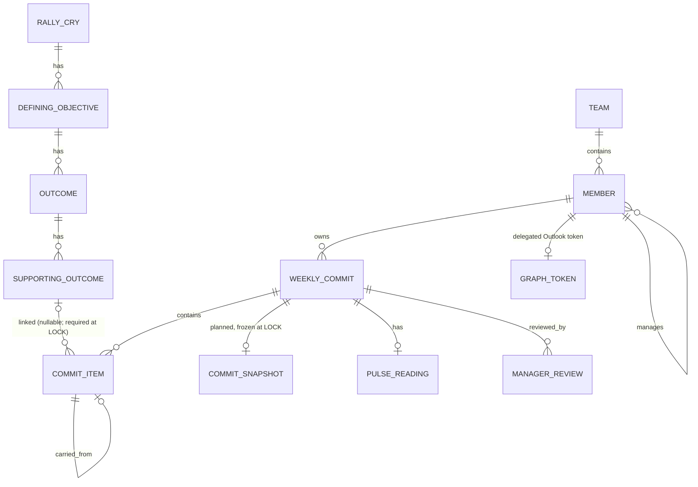

<!-- docs/TECHNICAL.md — the technical documentation deliverable for the Weekly Commit Module.
     Architecture by layer, the RCDO + weekly-commit data model, the lifecycle FSM, the security
     model, the integration design, the Brief Conformance table, the testing matrix, and the
     assumptions list. Every claim is anchored to a real file/endpoint in this repo. -->

# Weekly Commit Module — Technical Documentation

The Weekly Commit Module (WCM) replaces the 15Five weekly-planning slice for Solovis and enforces the
link between weekly work and company strategy. An employee drafts a weekly commit whose items each
link to an RCDO **Supporting Outcome** (enforced at LOCK, not at save), locks it, reconciles
planned-vs-actual, and carries forward unfinished items; a manager reviews per item and sees a team
roll-up of completion, carry-over, and RCDO alignment. Locking a commit can create a delegated
Outlook calendar event via Microsoft Graph.

Package root: `com.solovis.wcm`. Frontend: an Nx-shaped `apps/*` + `libs/*` workspace; the feature
ships as a **Vite Module Federation remote** (`wc-remote`) loaded by a thin `host-shell`.

---

## 1. Architecture by layer

### 1.1 Domain layer (`backend/.../{member,rcdo,commit,review}`)

Pure JPA entities + a hand-rolled FSM, deliberately persistence-light so the highest-value logic is
exhaustively unit-testable without a database.

- **Member / Team** (`member/`) — `Member` carries `email`, `displayName`, `title`, a self-FK
  `manager_id`, a `role`, and a unique `auth0_subject`. `MemberProvisioningService` JIT-creates a
  Member from the JWT subject on first authenticated request; `DemoSeeder` (`@Profile("demo")`)
  loads the Solovis manager graph + RCDO tree + sample commits.
- **RCDO hierarchy** (`rcdo/`) — four entities, `RallyCry → DefiningObjective → Outcome →
  SupportingOutcome`, each child carrying a NOT-NULL parent FK. `RcdoQueryService` serves the nested
  tree and the filtered Supporting-Outcome leaves.
- **Weekly commit aggregate** (`commit/`) — `WeeklyCommit` (owner `member_id`, `week_start`,
  `LifecycleState`, `submittedAt`, `reviewedAt`) contains `CommitItem`s. Each item has a **nullable**
  `supporting_outcome_id`, an ordered `chess_tier` (`ChessTier`: `KING > QUEEN > ROOK > BISHOP >
  KNIGHT > PAWN`), a `CommitItemStatus` (`OPEN`/`COMPLETE`/`INCOMPLETE`/`CARRIED_FORWARD`), and a
  `carried_from_item_id` self-link. `CommitSnapshot` + `SnapshotItem` freeze the plan at LOCK.
  `PulseReading` is a thin weekly pulse.
- **Review** (`review/`) — `ManagerReview` (per-commit, `ReviewState`), plus the roll-up query
  services.

The `LifecycleService` (`commit/LifecycleService.java`) is the single owner of every legal transition
and the side effects each implies (snapshot at LOCK, review-forced-at-RECONCILED, carry-forward copy).
It holds **no repositories** — callers persist what it returns.

### 1.2 API layer (`backend/.../*Controller.java`)

Thin REST controllers; identity/ownership/state decisions live in the services. All app routes are
under `/api/*` and require a valid bearer token (except the health/OpenAPI probes and the tokenless
Graph consent callback). Errors render as **RFC-7807 `ProblemDetail`** via
`common/ApiExceptionHandler.java`. `springdoc-openapi` serves `/v3/api-docs` + Swagger UI from the
controller/DTO annotations.

REST surface (verified against the controllers):

| Method · Path | Controller | Purpose | Authz |
|---|---|---|---|
| `POST /api/commits` | CommitController | Create a DRAFT (owner = JWT subject) | owner |
| `GET /api/commits` | CommitController | The acting member's week headers | owner |
| `GET /api/commits/current` | CommitController | Current open week (204 if none) | owner |
| `GET /api/commits/{id}` | CommitController | Read one commit (403 if not yours) | owner |
| `PUT /api/commits/{id}` | CommitController | Replace DRAFT items (409 if LOCKED+) | owner |
| `POST /api/commits/{id}/submit` | CommitController | DRAFT → LOCKED (422 if any item unlinked) | owner |
| `POST /api/commits/{id}/reconcile` | ReconciliationController | LOCKED → RECONCILING | **manager scope** |
| `PATCH /api/commits/{id}/items/{itemId}/status` | ReconciliationController | Patch an item's ACTUAL status (RECONCILING only) | owner |
| `POST /api/commits/{id}/reconciled` | ReconciliationController | RECONCILING → RECONCILED | **manager scope** |
| `GET /api/commits/{id}/reconciliation` | ReconciliationController | Planned-vs-actual diff | owner |
| `POST /api/commits/{id}/carry-forward` | ReconciliationController | Carry unfinished items into a new DRAFT | owner |
| `GET /api/commits/{id}/pulse` · `PUT …/pulse` | PulseController | Weekly pulse read/upsert | owner |
| `POST /api/commits/{id}/review` | ReviewController | Per-commit manager review | **manager scope** |
| `GET /api/review-queue?weekStart=&page=&size=` | ReviewQueueController | Manager's review queue (Pageable) | **manager scope** |
| `GET /api/rollup?page=&size=` | RollupController | Team roll-up + metrics (Pageable ≤2000) | **manager scope** |
| `GET /api/rollup/reports/{memberId}/latest-commit` | RollupController | Dashboard drill-through resolver | manager scope |
| `GET /api/rcdo/tree` · `GET /api/rcdo/supporting-outcomes?q=` | RcdoController | RCDO tree + picker filter | authenticated |
| `GET /api/integration/outlook` · `POST …/connect` · `DELETE …` · `PUT …/settings` | OutlookController | Outlook connection + sync preference | owner |
| `GET /api/graph/connect` · `GET /api/graph/callback` · `GET /api/graph/status` | GraphConsentController | Delegated consent (connect/status JWT-gated; **callback is tokenless, guarded by signed state**) | see §4 |
| `POST /api/e2e/reset` · `POST /api/e2e/commits/{id}/inject-item` | E2eResetController (`@Profile("e2e")`) | Hermetic per-scenario reset/inject | e2e only |

Paging uses a **flat `PageResponse<T>`** envelope (`common/PageResponse.java`:
`{content,totalElements,totalPages,number,size}`) — not Spring's nested `PagedModel` — because the
FE's `Page<T>` contract + RTK Query read it directly. `RollupQueryService`/`ReviewQueueService` cap
size at 2000 (the NFR) and apply a stable sort.

### 1.3 Security / authorization layer (`backend/.../common`)

`SecurityConfig` (`@Profile("!e2e")`) turns the API into an Auth0 OAuth2 **resource server**. A single
always-on `SecurityFilterChain`: permits `/actuator/health` + the OpenAPI docs + `GET
/api/graph/callback`; gates the manager routes (`/api/rollup`, `/api/review-queue`, `POST
…/review`, `POST …/reconcile`, `POST …/reconciled`) behind `SCOPE_reconcile:commits`; requires a
valid JWT everywhere else. Both the standard `scope` claim and Auth0's `permissions` array map to
`SCOPE_*` authorities. The prod RS256 `JwtDecoder` (issuer + audience + JWKS validation) is built only
when `AUTH0_ISSUER_URI` is set, so a bare boot or the test profile still starts — and that decoder
rejects forged test-JWTs (wrong issuer/signature). **Endpoint scope ≠ data scope:** every service
also enforces **row-level ownership** from the JWT-resolved member (`CurrentMemberProvider`), never a
client-supplied id. See §4 for the full model.

### 1.4 Integrations layer (`backend/.../integration`, `backend/.../event`)

- **Outlook / Microsoft Graph** — `CalendarSyncPort` is the seam. `StubCalendarAdapter`
  (`@Profile("!graph")`) records calls for tests; `GraphCalendarAdapter` (`@Profile("graph")`) POSTs
  a real delegated event to `/me/events`. A per-user `GraphToken` is encrypted at rest
  (`TokenCipher`, AES-256), obtained via the consent flow (`GraphConsentController` +
  `GraphTokenService`), and refreshed before each call.
- **Eventing (SNS → SQS)** — lifecycle transitions publish `DomainEvent`s through an `EventPublisher`
  port. Default is `InProcessEventPublisher` (synchronous, in-VM); under `@Profile("aws")`,
  `SnsEventPublisher` publishes JSON to an SNS topic and `SqsEventPoller` long-polls the subscribed
  queue and dispatches to the same consumers (e.g. `CommitLockedCalendarConsumer`). Consumers are
  idempotent (event-id dedup), so an at-least-once redelivery does not double-sync Outlook. The app
  boots with **no AWS creds** because the AWS beans are profile-gated.

### 1.5 Frontend layer (`apps/`, `libs/`)

- **MF remote** — `apps/wc-remote/vite.config.ts` exposes `./WeeklyCommitApp` as `remoteEntry.js`,
  sharing `react`, `react-dom`, and `react-router-dom` as singletons. `host-shell` declares the
  remote and provides the BrowserRouter + Auth0; the remote consumes a host-injected
  `getToken()`/`user` (via `AuthBridge`) or self-provides Auth0 when standalone.
- **Routing** — `apps/wc-remote/src/app/routes.tsx` is the internal route table; **every screen is a
  lazy `React.lazy` chunk** under one `<Suspense>` (the sub-second-render NFR / code-split CDN
  bundle). Manager routes are wrapped in `RequireManager` (a UX gate; real authz is server-side).
- **Data** — `libs/api/src/commitApi.ts` is the **only** way app code reaches the backend: an RTK
  Query slice covering every endpoint with a `providesTags`/`invalidatesTags` graph (e.g. submit
  invalidates the week list). It injects `Authorization: Bearer` from the token provider, or
  `X-Debug-Member` in the hermetic E2E path. `libs/api/src/msw/handlers.ts` mirrors the contract so
  FE units run with no backend.
- **Shared UI** — `libs/ui` holds the reusable primitives (lifecycle badge with text+icon for a11y,
  RCDO chip/breadcrumb, autosave indicator, past-due banner, carried-forward card, skeleton/empty/
  error states, confirm dialog, the role-conditional sub-nav).

---

## 2. Data model (RCDO + weekly commit)



Key modeling decisions:

- **All entities extend `AbstractAuditingEntity`** (`createdBy/createdDate/lastModifiedBy/
  lastModifiedDate`, populated by JPA auditing; `AuditorAware` reads the JWT subject). UUID primary
  keys. Lombok `@Getter/@Setter/@Builder` (never `@Data`).
- **`supporting_outcome_id` is NULLABLE at the column** so a DRAFT item can exist before it is
  linked; the link is **required by the DRAFT→LOCKED guard**, not the schema. This keeps "every
  locked commitment is linked" true while removing the draft dead-end.
- **Reconciliation = immutable snapshot (plan) vs live status (actual).** At LOCK the
  `LifecycleService` freezes each item's text/link/tier into a `CommitSnapshot`; thereafter the live
  `CommitItem.status` carries the *actual*, mutable **only** while RECONCILING. The
  `reconciliation` view diffs the two and flags incomplete / carried / **added-after-lock** rows.
- **Migrations** are Flyway, `V1__baseline` … `V8__outlook_preference` under
  `backend/src/main/resources/db/migration`; Hibernate runs `ddl-auto: validate` (Flyway owns the
  schema). Postgres is pinned to **16.4** (compose + CI service + the docs).

---

## 3. Lifecycle FSM (server-enforced)

```mermaid
stateDiagram-v2
  [*] --> DRAFT: period opens
  DRAFT --> DRAFT: autosave (items may be unlinked)
  DRAFT --> LOCKED: submit — GUARD: ≥1 item AND every item linked; writes the immutable snapshot
  LOCKED --> RECONCILING: start reconcile / open review
  RECONCILING --> RECONCILING: item ACTUAL status edits (content stays frozen → 409)
  RECONCILING --> RECONCILED: mark reviewed (also forces ManagerReview = REVIEWED)
  RECONCILED --> CARRY_FORWARD: copy unfinished items into next week's DRAFT
  LOCKED --> CARRY_FORWARD: escape hatch (allowed)
  CARRY_FORWARD --> [*]
```



Enumerated legal edges live in `LifecycleTransition` (`DRAFT→LOCKED`, `LOCKED→RECONCILING`,
`RECONCILING→RECONCILED`, `RECONCILED→CARRY_FORWARD`, and the `LOCKED→CARRY_FORWARD` escape hatch);
anything not enumerated is illegal by construction and is rejected as RFC-7807 `409 Conflict`. Guards
in `LifecycleService`:

- **`lock(...)`** — requires ≥1 item and that *every* item is linked, else `IllegalTransitionException`;
  on success freezes the snapshot, sets `LOCKED`, stamps `submittedAt`.
- **`assertItemEditAllowed(...)`** — a content edit (text/link/tier) is legal **only in DRAFT**; a
  status edit is legal **only in RECONCILING** (KTD4). Other combinations throw.
- **`reconcile(...)`** — forces the `ManagerReview` to `REVIEWED` (RECONCILED ⇒ reviewed) and stamps
  `reviewedAt` on both.
- **`carryForward(...)`** — legal from `RECONCILED` or `LOCKED`; copies every *unfinished* item
  (OPEN or INCOMPLETE, reset to OPEN, `carried_from_item_id` set) into a fresh next-week DRAFT, marks
  the sources `CARRIED_FORWARD`, and moves the old commit to `CARRY_FORWARD`.

---

## 4. Security model

Three layers, defense-in-depth:

1. **Auth0 resource server (authentication).** `SecurityConfig` validates RS256 Auth0 JWTs
   (issuer-uri + audience + JWKS via `NimbusJwtDecoder` + `AudienceValidator`). No token → 401.
2. **Scope-gated routes (coarse authorization).** Manager-only routes require
   `SCOPE_reconcile:commits`, mapped from Auth0 `scope`/`permissions`. An employee on a manager route
   → 403.
3. **Row-level ownership (fine authorization).** Every service resolves the acting member from the
   **JWT subject** (`CurrentMemberProvider` → `JwtCurrentMemberProvider`), never a body/param. A
   member reads only their own commits (403 otherwise); a manager's roll-up/review-queue is filtered
   to *their* reports by the token-derived `manager_id`. This closes the IDOR/BOLA paths a
   spoofed `memberId` would otherwise open — a spoofed body id is ignored, the owner is always the
   subject.

**Graph consent callback** (`GET /api/graph/callback`) is the one app route that is `permitAll`,
because Entra redirects the user's browser there with **no bearer token**. It is instead guarded by a
short-lived **HMAC-signed `state`** (`GraphConsentState`) minted by `/connect`, which binds the acting
member into a tamper-proof value (the CSRF / code-injection guard); a forged/stale callback is
rejected with 400 before any token is bound.

**E2E dev-auth isolation (KTD13).** Under `@Profile("e2e")` the `E2eSecurityConfig` replaces the
JWT chain with an `X-Debug-Member` header authenticator that resolves a *seeded* member (by email,
then `auth0|seed-<slug>` subject) and grants the manager scope to seeded managers. This lets a real
browser drive the live federated app with **no Auth0 tenant**. It is strictly test/e2e-path
infrastructure — `@Profile("e2e")`-only, never on the prod request path — alongside the
`E2eResetController` reset/inject endpoint. Prod/default/test keep the JWT-only chain.

Secrets are env refs (`${...}`) in `application.yml`, each defaulting to empty so a bare boot starts;
`.env.example` documents every one and a real `.env` is gitignored. Graph tokens are AES-256 encrypted
at rest.

---

## 5. Integration design

**Outlook (delegated Microsoft Graph).** The user connects Outlook on the Settings screen, which
calls `POST /api/integration/outlook/connect` → an Entra authorize URL (Authorization Code + PKCE,
delegated scopes `offline_access User.Read Calendars.ReadWrite`). After consent, the tokenless
callback exchanges the code and stores an encrypted per-user `GraphToken`. When a commit locks, the
`commit.locked` domain event drives `CommitLockedCalendarConsumer` → `CalendarSyncPort.syncLockedCommit`,
which (under `graph`) POSTs an all-day weekly event carrying the commit's items + a deep-link, refreshing
the token first. A Graph failure does **not** roll back the LOCK — calendar sync is a side effect, not
part of the transaction.

**Eventing (decoupled side-effects).** Lifecycle transitions emit `DomainEvent`s via `EventPublisher`.
Locally that is in-process and synchronous; in AWS it is `SnsEventPublisher` (publish JSON to SNS) +
`SqsEventPoller` (long-poll the subscribed SQS queue, dispatch to consumers). Consumers are idempotent
on event id, and SQS redrive/DLQ handles retries, so the request path stays fast and side-effects are
at-least-once-safe.

---

## 6. Brief Conformance

Each brief requirement → where it is satisfied (file/endpoint) or the deliberate deviation and why.
Brief = `assignment_description.md`.

| Brief requirement (source line) | Status — satisfied-by / deviated-because |
|---|---|
| **Replace 15Five weekly slice; commit → RCDO** (PRD, Problem & Context) | Satisfied — `commit/` aggregate + `rcdo/` hierarchy; `supporting_outcome_id` per `CommitItem`, enforced at LOCK by `LifecycleService.lock`. |
| **Weekly commit CRUD with RCDO linking** (Functional Reqs) | Satisfied — `CommitController` (CRUD + submit), `RcdoController` (tree/picker), `CommitService`. |
| **Chess layer for categorization & prioritization** (Functional Reqs) | Satisfied — `ChessTier` ordered enum (`KING…PAWN`); declaration order = priority. Tier set is *builder-decided* (see Assumptions). |
| **Full lifecycle FSM (DRAFT→LOCKED→RECONCILING→RECONCILED→Carry Forward)** | Satisfied — `LifecycleState` + `LifecycleTransition` + server-enforced `LifecycleService`; illegal edges → RFC-7807 409. |
| **Reconciliation (planned vs actual)** | Satisfied — immutable `CommitSnapshot` (plan) vs live `CommitItem.status` (actual); `ReconciliationService` + `GET …/reconciliation` diff. |
| **Manager dashboard with team roll-up** | Satisfied — `RollupController` (`GET /api/rollup`, Pageable, completion%/carry-over/RCDO-alignment), `RollupDashboard.tsx`; `ReviewQueueController`. |
| **Micro-frontend — PA host / PM remote pattern** | Satisfied — `wc-remote` exposes `./WeeklyCommitApp` via `@module-federation/vite`; `host-shell` loads it; shared singletons; single route entry; no hardcoded host chrome. |
| **API <200ms reads** (Perf) | Satisfied — single indexed reads + the k6 `perf/run-stress.sh` gate (p95<200ms); perf-asserted in integration tests. |
| **Lazy routes / sub-second initial render** (Perf) | Satisfied — every screen is a `React.lazy` chunk under one `<Suspense>` (`routes.tsx`). |
| **MF bundle optimized for CDN delivery** (Perf) | Satisfied (build) — chunked `remoteEntry.js`; intended S3 + CloudFront with CORS/cache headers (Deployment §). |
| **Pageable ≤2000** (Perf) | Satisfied — `PageResponse` + `@PageableDefault`, size capped at 2000 in the roll-up/queue services. |
| **TypeScript strict mode** (Code Quality) | Satisfied — `tsconfig.base.json` `strict` + `noUncheckedIndexedAccess` + `noUnusedLocals/Parameters`; CI `tsc --noEmit`. |
| **JaCoCo ≥80% backend coverage** (Code Quality) | Satisfied — `jacoco-check` BUNDLE line ≥0.80 in `pom.xml`; CI fails below. Honest exclusions (see note). |
| **Vitest unit tests for all components** (Code Quality) | Satisfied — Vitest + RTL across `apps`/`libs`; coverage gate in `vitest.workspace.ts`. **Note:** the FE gate is **70%**, not 80 — see Issues. |
| **Cypress E2E with Cucumber/Gherkin BDD** (Code Quality) | Satisfied — `e2e/cypress/e2e/features/*.feature` + step defs; run by `run-e2e.sh`. |
| **Playwright** (Dev Tools) | Satisfied — a thin Playwright smoke (`e2e/playwright/smoke.spec.ts`) alongside Cypress. The brief lists **both** Cypress+Gherkin (Code-Quality) and Playwright (Dev-Tools); both are provided (documented conflict). |
| **ESLint 9 + Prettier 3.3** (Code Quality) | Satisfied — `eslint.config.js` (flat, ESLint 9), Prettier `3.3.3`. |
| **Spotless + SpotBugs** (Code Quality) | Satisfied — both bound to `verify` in `pom.xml`; gates fail the build. |
| **All entities extend AbstractAuditingEntity** (Code Quality) | Satisfied — `common/AbstractAuditingEntity` + JPA auditing; all domain entities extend it. |
| **RTK Query for all API calls + cache invalidation** (Code Quality / Off-Limits) | Satisfied — `libs/api/commitApi.ts` is the sole data path with a tag-invalidation graph; **no Saga/Thunk, no raw fetch** in app code. |
| **Java 21 / Spring Boot 3.3 / Postgres 16.4 / Hibernate-JPA / Flyway** (Tech) | Satisfied — `pom.xml` Spring Boot 3.3.13 + Java 21; Flyway V1…V8; Postgres 16.4 (compose + CI). |
| **Auth0 (OAuth2 JWT)** (Tech) | Satisfied — `SecurityConfig` resource server **+ row-level authz** (beyond the brief). |
| **Flowbite React + Tailwind; no CSS modules/styled-components** (Tech / Off-Limits) | Satisfied — Tailwind utilities + Flowbite; no CSS modules / styled-components. |
| **No SSR (Next/Remix); client-side SPA** (Off-Limits) | Satisfied — Vite SPA remote; no SSR framework. |
| **Lombok @Getter/@Setter/@Builder (not @Data)** (Off-Limits) | Satisfied — entities use the explicit annotations; no `@Data`. |
| **Outlook Graph API integration** (Tech) | Satisfied — delegated `/me/events` via `CalendarSyncPort`/`GraphCalendarAdapter` + consent flow + encrypted token store. |
| **AWS — EKS, CloudFront, S3, SQS/SNS** (Cloud) | **Partially satisfied / deviated** — the SNS→SQS event seam is built and abstracted (`EventPublisher`, `aws` profile, LocalStack tests); EKS/S3/CloudFront provisioning is design + runbook only, gated on AWS creds + cost approval (Deployment §, Issues). |
| **Yarn Workspaces + Nx** (Tech) | **Deviated** — npm workspaces (not Yarn) with the same `apps/*`+`libs/*` layout; Nx kept for the task graph. PRD line 77 says PA's package manager need not be replicated. |

**JaCoCo exclusions rationale.** The 80% bar excludes `WcmApplication`, `*Config*`,
`AbstractAuditingEntity`, and the two `@Profile("e2e")` test-path classes
(`DebugHeaderCurrentMemberProvider`, `E2eResetController`) — boot/config/glue and test scaffolding
that is never on the prod request path. The *product* code carries the bar.

---

## 7. Testing matrix

| Layer | Where | Approx. count | How to run |
|---|---|---|---|
| **Unit (FE)** | `apps/**/*.test.tsx`, `libs/**/*.test.ts(x)` (RTL + MSW) | ~88 cases in 21 files | `npx vitest run --coverage` |
| **Unit (BE domain)** | `commit/LifecycleServiceTest`, `GraphConsentStateTest`, `TokenCipherTest`, validators, … | part of ~129 BE `@Test` | `mvn -f backend/pom.xml test` |
| **API (BE)** | MockMvc controller ITs (`CommitControllerIT`, `ReconciliationControllerIT`, `RollupControllerIT`, `RcdoControllerIT`, `NewEndpointsControllerIT`) | part of ~129 | `mvn -f backend/pom.xml verify` |
| **Subsystem (BE)** | Persistence (`@DataJpaTest` + Testcontainers: `CommitRepositoryIT`, `RcdoRepositoryIT`, `AuditingEntityIT`, `CommitSnapshotIT`), security (`SecurityIntegrationTest`), provisioning/seed (`MemberProvisioningIT`, `DemoSeederIT`), eventing (`EventingIT`, `SnsSqsEventingIT` on LocalStack, `CommitLockedConsumerIT`), Graph (`GraphCalendarAdapterTest` on MockWebServer, `GraphTokenServiceTest`, `GraphConsentCallbackIT`), OpenAPI (`OpenApiContractIT`) | part of ~129 (30 BE test files) | `mvn -f backend/pom.xml verify` |
| **E2E** | `e2e/cypress/e2e/features/*.feature` (lifecycle, reconciliation, manager roll-up) + step defs; Playwright smoke | 6 Gherkin scenarios + 1 Playwright smoke | `bash e2e/run-e2e.sh` |
| **Stress** | `perf/stress.js` (k6 ramp over the hot read paths; p95<200ms gate) | 1 scenario, 5 read paths | `bash perf/run-stress.sh` |

`mvn verify` runs surefire (unit) **and** failsafe (Testcontainers ITs) and then the Spotless,
SpotBugs and JaCoCo gates — so the Unit/API/Subsystem BE rows are all one command. The hermetic
suites use test doubles (Graph stub/MockWebServer, test-JWT, Testcontainers/LocalStack) so CI runs
offline and deterministically; a separate *live* real-integration suite (real Auth0 / Graph / deployed
AWS) is gated in CI on secret presence.

To run everything in order:

```bash
docker compose up -d postgres
npm ci && npx tsc --noEmit -p tsconfig.base.json && npx vitest run --coverage   # FE
mvn -f backend/pom.xml verify                                                    # BE (+ gates)
bash e2e/run-e2e.sh                                                              # E2E
bash perf/run-stress.sh                                                          # stress
```

---

## 8. Assumptions

1. **npm, not Yarn.** The brief lists Yarn Workspaces; this build uses **npm workspaces** with the
   same `apps/*`+`libs/*` shape, per **PRD line 77** ("you don't need to replicate" PA's package
   management). Nx is retained for the task graph. Low-risk deviation, documented in Brief
   Conformance.
2. **Solovis seed is synthesized.** The demo seed (`DemoSeeder` / `SOLOVIS_SEED.md`) is a *plausible,
   internally-consistent* Solovis-flavored RCDO tree + manager graph; it is **not** pulled from
   Solovis internal planning. Swap for real values if the technical contact provides them.
3. **RCDO is 4 tiers; "chess" = ordered priority tiers — builder-decided.** RCDO = Rally Cry →
   Defining Objective → Outcome → Supporting Outcome (link leaf). The chess layer is the ordered
   `ChessTier` enum (`KING…PAWN`). These shape choices were decided by the *builder*, not the brief's
   real **Technical Contact** (`Technical Contact: Yes`); `rcdo/` + `chess_tier` are kept genuinely
   swappable, and `docs/research/technical-contact-questions.md` records the open questions.
4. **Auth0 / Graph credentials come later.** The app boots with every external secret blank (env refs
   default to empty); Auth0 validation activates when `AUTH0_ISSUER_URI` is set and the Graph adapter
   under the `graph` profile. The hermetic test/E2E paths need no live tenant. Guided setup:
   `docs/setup/EXTERNAL_SERVICES_SETUP.md`.
5. **E2E uses dev-auth, not real Auth0.** Browser E2E runs under `@Profile("e2e")` with the
   `X-Debug-Member` header authenticator against seeded members, isolated to the e2e path — so the
   federated UI is exercised end-to-end without an Auth0 tenant in CI.
6. **AS4 not enforced.** Week-within-RCDO-date-window containment is deferred (not enforced) — noted
   as an open question.

---

## 9. Deployment & runbook

**Targets.** Backend container → ECR/EKS (multi-stage JRE-21 image, `/actuator/health` readiness/
liveness); **RDS PostgreSQL 16.4**; frontend (`host-shell` + `wc-remote`'s `remoteEntry.js`) → S3 +
CloudFront with CORS + cache headers; **SNS topic + SQS queue + DLQ** for the event seam; Auth0/Graph/
DB secrets in Secrets Manager/SSM. The event seam flips from in-process to SNS→SQS purely by
activating the `aws` Spring profile and setting `WCM_SNS_TOPIC_ARN`/`WCM_SQS_QUEUE_URL`.

**Local equivalent (always available).** `docker compose up -d postgres` + the backend under
`e2e,demo` + the federated FE is the full product locally; LocalStack-backed tests prove the SNS→SQS
path offline.

**Gating.** Real provisioning (`cdk deploy`/EKS spin-up) needs AWS credentials **and** explicit cost
approval; it is intentionally not executed by the default CI. The CI `live` job runs the U32 real-
integration suite (real Auth0 / Graph / deployed AWS) only when the corresponding secrets are present,
and is required-green before "done."
