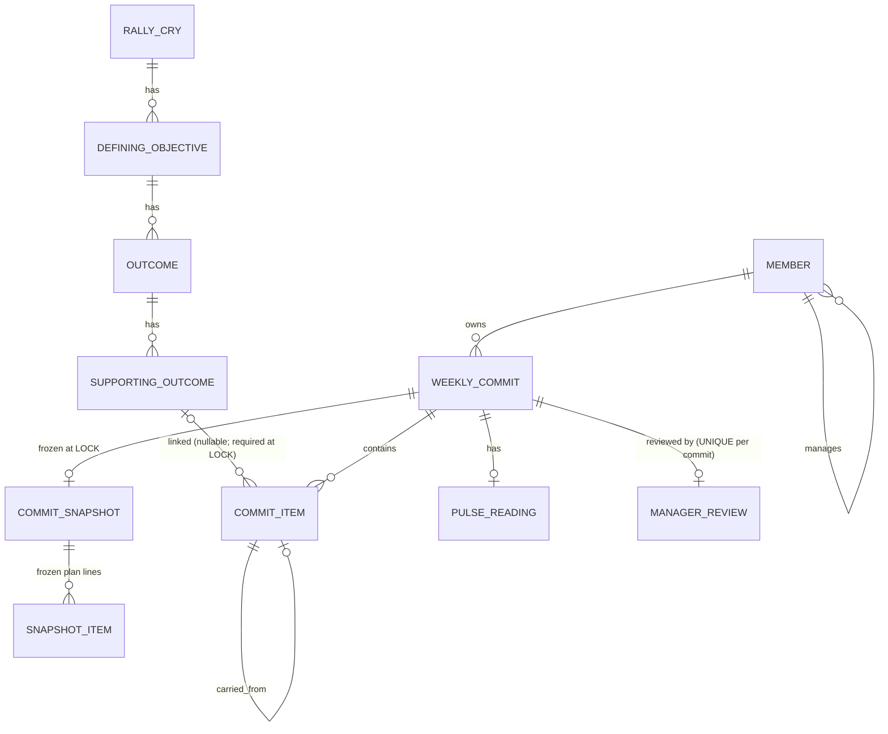

<!-- docs/layers/01-domain-lifecycle.md — the WCM backend domain & lifecycle layer.
  Covers the RCDO hierarchy, the WeeklyCommit aggregate, the LifecycleService FSM, the
  snapshot/reconciliation model, auditing, and the Flyway schema. Every claim anchored to path:line. -->

# Domain & Lifecycle (Backend)

## Executive summary

This is the heart of the Weekly Commit Module: the entities that model company strategy and weekly work, plus the hand-rolled state machine that governs how a weekly commit moves from draft to locked to reconciled to carried-forward. The strategy side is a four-level **RCDO** tree (Rally Cry → Defining Objective → Outcome → Supporting Outcome); the work side is the **WeeklyCommit** aggregate — a member's plan for one week, made of **CommitItem**s that each link to a Supporting Outcome. The single owner of every legal state change is `LifecycleService` (`backend/src/main/java/com/solovis/wcm/commit/LifecycleService.java:19`), a *pure* domain object that holds no repositories — it validates a transition, mutates the in-memory objects, and returns what the caller must persist. Because the FSM is persistence-free, the highest-value rules (lock requires every item linked; content is editable only in DRAFT; status only in RECONCILING; a LOCK freezes an immutable snapshot) are exhaustively unit-testable without a database. The application services in the [API & Contract](02-api-contract.md) layer wrap this domain core with row-level authorization and Spring Data persistence.

## Responsibilities

- **Accountable for:** modeling the RCDO strategy hierarchy and the weekly-commit aggregate as JPA entities · defining and enforcing the lifecycle FSM (legal edges + per-transition guards) · freezing the plan into an immutable snapshot at LOCK and diffing it against live status during reconciliation · the carry-forward copy of unfinished items into next week · the shared auditing superclass (`createdBy`/`createdDate`/`lastModifiedBy`/`lastModifiedDate`, UUID PKs) · the Flyway schema that backs all of it.
- **Explicitly NOT:** persistence orchestration (the FSM holds **no** repositories — callers in `CommitService`/`ReconciliationService` save what it returns; `LifecycleService.java:4`) · identity/ownership/scope authorization (that lives in the services + `SecurityConfig`, see [API & Contract](02-api-contract.md)) · HTTP/JSON shaping · calendar/event side effects (the integration layer).

## Key components

| Component | What it does | Where |
|-----------|--------------|-------|
| `RallyCry` | Top of the RCDO tree (annual theme); parent of DefiningObjective; nullable `ownerId` | `backend/src/main/java/com/solovis/wcm/rcdo/RallyCry.java:24` |
| `DefiningObjective` | 2nd level; NOT-NULL `rallyCryId` parent FK | `backend/src/main/java/com/solovis/wcm/rcdo/DefiningObjective.java:30` |
| `Outcome` | 3rd level; NOT-NULL `definingObjectiveId` parent FK | `backend/src/main/java/com/solovis/wcm/rcdo/Outcome.java:30` |
| `SupportingOutcome` | RCDO leaf; NOT-NULL `outcomeId`; the link target of a CommitItem | `backend/src/main/java/com/solovis/wcm/rcdo/SupportingOutcome.java:29` |
| `WeeklyCommit` | Aggregate root; `memberId`+`weekStart` (UNIQUE), `lifecycleState`, transient `items` working set | `backend/src/main/java/com/solovis/wcm/commit/WeeklyCommit.java:32` |
| `CommitItem` | One plan line; **nullable** `supportingOutcomeId`, `chessTier`, `status`, `carriedFromItemId` | `backend/src/main/java/com/solovis/wcm/commit/CommitItem.java:24` |
| `ChessTier` | Ordered priority enum `KING > QUEEN > ROOK > BISHOP > KNIGHT > PAWN` (declaration order = rank) | `backend/src/main/java/com/solovis/wcm/commit/ChessTier.java:6` |
| `CommitItemStatus` | The live ACTUAL: `OPEN`/`COMPLETE`/`INCOMPLETE`/`CARRIED_FORWARD` | `backend/src/main/java/com/solovis/wcm/commit/CommitItemStatus.java:6` |
| `CommitSnapshot` | The frozen plan captured at LOCK; one per commit (UNIQUE) | `backend/src/main/java/com/solovis/wcm/commit/CommitSnapshot.java:27` |
| `SnapshotItem` | One frozen plan line (text/link/tier only — never status); `commitItemId` join key | `backend/src/main/java/com/solovis/wcm/commit/SnapshotItem.java:27` |
| `PulseReading` | Thin 1..5 weekly sentiment reading, optionally private from the manager | `backend/src/main/java/com/solovis/wcm/commit/PulseReading.java:22` |
| `ManagerReview` | Per-commit review; `ReviewState` gates RECONCILING→RECONCILED; UNIQUE per commit | `backend/src/main/java/com/solovis/wcm/review/ManagerReview.java:32` |
| `LifecycleState` | The five FSM states | `backend/src/main/java/com/solovis/wcm/commit/LifecycleState.java:6` |
| `LifecycleTransition` | The enumerated legal edges + `isLegal`/`legalTargets` adjacency | `backend/src/main/java/com/solovis/wcm/commit/LifecycleTransition.java:10` |
| `LifecycleService` | The FSM: guards `lock`/`startReconciling`/`reconcile`/`carryForward`/`assertItemEditAllowed`; no repos | `backend/src/main/java/com/solovis/wcm/commit/LifecycleService.java:19` |
| `AbstractAuditingEntity` | `@MappedSuperclass` adding audit columns + `Persistable` (assigned-UUID INSERT vs merge) | `backend/src/main/java/com/solovis/wcm/common/AbstractAuditingEntity.java:30` |
| `JpaConfig` | Enables JPA auditing; `AuditorAware` resolves the JWT subject (else `"system"`) | `backend/src/main/java/com/solovis/wcm/common/JpaConfig.java:16` |

## Interfaces & contracts

The FSM exposes a small, typed surface (all on `LifecycleService`):

- `assertLegal(from, to)` — validates an arbitrary edge against the table only (no guards); throws `IllegalTransitionException` if not enumerated (`LifecycleService.java:26`).
- `lock(commit, lockedAt) -> CommitSnapshot` — the guarded DRAFT→LOCKED move; returns the snapshot for the caller to persist (`LifecycleService.java:39`).
- `startReconciling(commit)` — LOCKED→RECONCILING (`LifecycleService.java:66`).
- `reconcile(commit, review, reviewedAt)` — RECONCILING→RECONCILED; forces the review REVIEWED (`LifecycleService.java:75`).
- `carryForward(commit, nextWeekStart) -> WeeklyCommit` — builds and returns next week's DRAFT (`LifecycleService.java:92`).
- `assertItemEditAllowed(commit, contentChanged)` — the content-vs-status edit guard (`LifecycleService.java:126`).
- `legalNext(commit) -> List<LifecycleState>` — discoverable next states (`LifecycleService.java:139`).

**Invariant contracts** encoded in the entities themselves:

- `CommitItem.isLinked()` — `supportingOutcomeId != null`; the lock guard's input (`CommitItem.java:76`).
- `CommitItem.isUnfinished()` — `OPEN || INCOMPLETE`; the carry-forward predicate (`CommitItem.java:87`).
- `WeeklyCommit.allItemsLinked()` — non-empty **and** every item linked; the empty-list case is deliberately false (`WeeklyCommit.java:104`).
- `ManagerReview.isReviewed()` / `markReviewed(when)` — gate and effect of RECONCILED (`ManagerReview.java:72`, `:78`).
- `ChessTier.outranks(other)` — `this.ordinal() < other.ordinal()`, so KING outranks all (`ChessTier.java:15`).

## Data & state

**The RCDO hierarchy.** Four entities, each child carrying a NOT-NULL parent FK enforced at the schema (V3): `defining_objective.rally_cry_id` (`V3__rcdo.sql:21`), `outcome.defining_objective_id` (`V3__rcdo.sql:32`), `supporting_outcome.outcome_id` (`V3__rcdo.sql:44`). Window dates exist on every level but containment is intentionally **not** enforced (AS4, `V3__rcdo.sql:4`). An optional `owner_id → member` exists on the leaf from V3 and was added to the three upper levels in V9 (`V9__rcdo_owner_ids.sql:7`).

**The weekly-commit aggregate.** `WeeklyCommit` owns `member_id`+`week_start` under a UNIQUE constraint (`V4__weekly_commit.sql:17`), `lifecycle_state`, and review bookkeeping (`submittedAt`/`reviewerId`/`reviewedAt`). Its `items` list is **transient** — not a JPA association — so children persist via `CommitItemRepository`, keeping the schema flat and `ddl-auto: validate` honest (`WeeklyCommit.java:58`). `CommitItem.supportingOutcomeId` is **nullable at the column** (KTD5) so a draft item can exist before it is linked; the link is required by the DRAFT→LOCKED guard, not the schema (`CommitItem.java:41`, `V4__weekly_commit.sql:48`). `chess_tier` and `carried_from_item_id` (self-link) are also nullable.

**Reconciliation = immutable plan vs live actual.** At LOCK, `SnapshotItem.freeze(...)` copies each item's **text/link/tier only — never status** (`SnapshotItem.java:74`); it also captures the source `CommitItem.id` into `commitItemId` as the deterministic join key (text/link/tier are non-unique, so they cannot pair plan lines to live items reliably; `SnapshotItem.java:37`). Thereafter `CommitItem.status` carries the mutable ACTUAL, editable only while RECONCILING. The diff joins on `commitItemId`; a live item absent from the snapshot is flagged `ADDED_AFTER_LOCK`, and pre-LOCK (no snapshot) the diff returns an empty, not-applicable view (`ReconciliationService.java:157`). The four per-row verdicts live in `ReconciliationFlag` (`COMPLETED`/`INCOMPLETE`/`CARRIED`/`ADDED_AFTER_LOCK`, `ReconciliationFlag.java:7`).

**State transitions** are confined to the five `LifecycleState` values, driven only through `LifecycleService`.

```mermaid
stateDiagram-v2
  [*] --> DRAFT: period opens
  DRAFT --> DRAFT: PUT items / status patch rejected (content edits only in DRAFT)
  DRAFT --> LOCKED: lock() — GUARD: >=1 item AND every item linked; freezes snapshot, stamps submittedAt
  LOCKED --> RECONCILING: startReconciling()
  RECONCILING --> RECONCILING: status patch (content frozen)
  RECONCILING --> RECONCILED: reconcile() — also forces ManagerReview = REVIEWED, stamps reviewedAt
  RECONCILED --> CARRY_FORWARD: carryForward() — copy OPEN/INCOMPLETE items into next-week DRAFT
  LOCKED --> CARRY_FORWARD: carryForward() escape hatch (whole still-OPEN plan rolls forward)
  CARRY_FORWARD --> [*]
```

The data model (entity/table names verified against the entity classes):

**Auditing.** Every domain entity extends `AbstractAuditingEntity` (`@MappedSuperclass`, `AbstractAuditingEntity.java:28`), which contributes `createdBy`/`createdDate`/`lastModifiedBy`/`lastModifiedDate` populated by `AuditingEntityListener` (`:34`–`:48`). `JpaConfig` enables auditing and its `AuditorAware` returns the current `Authentication.getName()` — the JWT subject — falling back to `"system"` when unauthenticated (`JpaConfig.java:19`–`:28`). PKs are caller-**assigned** UUIDs (no `@GeneratedValue`); `Persistable.isNew()` (true until first load/persist) tells Spring Data to INSERT rather than merge, which fixes FK ordering when a parent and child are saved in one transaction (`AbstractAuditingEntity.java:50`–`:71`). All entities use Lombok `@Getter/@Setter/@Builder` with `@NoArgsConstructor` — never `@Data` (e.g. `WeeklyCommit.java:27`–`:30`).

## Dependencies

- **Depends on:** Spring Data JPA + Hibernate (entities, `AuditingEntityListener`), Spring Data `Persistable`, the Flyway-managed Postgres schema (`db/migration/V1..V10`), Lombok, and Spring Security's `SecurityContextHolder` (only for `AuditorAware`, `JpaConfig.java:21`). `LifecycleService` itself depends on nothing but `ManagerReview` and the JDK.
- **Used by:** the application services `CommitService` (`backend/src/main/java/com/solovis/wcm/commit/CommitService.java:39`), `ReconciliationService` (`.../ReconciliationService.java:44`), `ReviewService`, `RcdoQueryService`/`RcdoAdminService`, `RollupQueryService`/`ReviewQueueService`, and the [API & Contract](02-api-contract.md) controllers that wrap them; the integration layer's `commit.locked` consumer reads the locked aggregate.

## How it works (flow)

The canonical owner→manager lifecycle, with the FSM as the pivot:

1. **Create / edit (DRAFT).** `CommitService.create` builds a DRAFT owned by the acting member (body `memberId` ignored, `CommitService.java:74`). `update` calls `assertItemEditAllowed(commit, true)` — a content edit, legal only in DRAFT, else 409 (`CommitService.java:131`; guard at `LifecycleService.java:126`). `replaceItems` validates each non-null link against the RCDO leaf table so a bad link is a clean 404, not a DB FK 409 (`CommitService.java:208`).
2. **Submit (DRAFT → LOCKED).** `CommitService.submit` hydrates the items, rejects a zero-item commit as 422, then 422s any unlinked item (`CommitService.java:142`–`:154`), then calls `lifecycle.lock(...)`. The guard re-checks non-empty and every-item-linked (`LifecycleService.java:41`–`:54`), freezes a `CommitSnapshot` of every item (`:55`–`:59`), sets `LOCKED`, and stamps `submittedAt` (`:60`–`:61`). The service persists the commit + snapshot + snapshot items and publishes `commit.locked` (`CommitService.java:155`–`:159`).
3. **Open reconcile (LOCKED → RECONCILING).** Driven by the owner's manager (`ReconciliationService.startReconciling`, `:82`). `lifecycle.startReconciling` flips the state, opening the status-edit window (`LifecycleService.java:66`).
4. **Record actuals (RECONCILING).** The owner patches item status; `assertItemEditAllowed(commit, false)` permits a status-only edit only in RECONCILING (`ReconciliationService.java:97`; guard at `LifecycleService.java:132`). The snapshot is untouched.
5. **Mark reviewed (RECONCILING → RECONCILED).** The manager calls `markReconciled`; `lifecycle.reconcile(commit, review, now)` marks the `ManagerReview` REVIEWED and stamps `reviewedAt` on both (`LifecycleService.java:75`–`:81`). The invariant "RECONCILED ⇒ REVIEWED" is therefore impossible to violate. `review.completed` is published (`ReconciliationService.java:136`).
6. **Carry forward (RECONCILED or LOCKED → CARRY_FORWARD).** `lifecycle.carryForward` builds next week's DRAFT and copies every `isUnfinished()` item (OPEN/INCOMPLETE) into it — status reset to OPEN, `carriedFromItemId` = source id — marks the sources `CARRIED_FORWARD`, and moves the old commit to `CARRY_FORWARD` (`LifecycleService.java:92`–`:118`). The service guards the next-week UNIQUE collision as a clean 409 before and during the INSERT (`ReconciliationService.java:211`–`:238`).

Throughout, an edge not enumerated in `LifecycleTransition` is illegal by construction (`LifecycleTransition.java:49`), and `requireState` rejects a guarded move from the wrong state (`LifecycleService.java:143`), both surfacing as `IllegalTransitionException` → 409.

## Design decisions & rationale

- **The FSM holds no repositories.** Pure domain logic returns objects for the caller to persist (`LifecycleService.java:4`). This keeps every guard unit-testable without a DB and makes persistence a service concern.
- **Nullable link at the column, required at LOCK (KTD5).** A draft can hold an unlinked item (no dead-end), yet "every locked commitment is linked" stays true because the guard enforces it (`CommitItem.java:41`, `WeeklyCommit.java:104`).
- **Immutable snapshot vs live status (KTD4).** Freezing text/link/tier (never status) at LOCK gives reconciliation a stable "plan" to diff against the mutable "actual", and the captured `commitItemId` is a deterministic join key (`SnapshotItem.java:37`).
- **`allMatch` over an empty list is vacuously true** — so `allItemsLinked()` explicitly requires non-empty, preventing an item-less commit from locking (`WeeklyCommit.java:98`–`:106`).
- **Assigned-UUID PKs + `Persistable`** fix parent-before-child INSERT ordering when seeding a whole RCDO tree in one transaction (`AbstractAuditingEntity.java:50`).
- **Carry-forward treats OPEN as unfinished** to agree with the reconciliation diff (which flags OPEN as INCOMPLETE) and to let the LOCKED escape hatch roll a whole still-OPEN plan forward (`CommitItem.java:80`–`:89`).
- **Chess priority by declaration order** — `ordinal()`/`compareTo()` rank items, KING highest; the tier set is deliberately swappable to High/Med/Low (`ChessTier.java:2`–`:3`).

## Gotchas & sharp edges

- **`getItems()` is unmodifiable; mutate only via `addItem`.** The Lombok getter is suppressed and a defensive copy returned (`WeeklyCommit.java:88`). Services must `hydrate(...)` the transient list from the repository before calling the FSM (e.g. `CommitService.java:230`, `ReconciliationService.java:222`).
- **Carry-forward items leave the FSM without a `weeklyCommitId`.** The FSM cannot know the new commit's id, so the service stamps it after the new commit is saved (`ReconciliationService.java:239`–`:247`); persisting them before that would violate the NOT-NULL FK.
- **No cascade on the flat FKs.** Children persist and delete independently — the e2e reset deletes in child-before-parent order by hand (`E2eResetController.java:75`–`:82`).
- **Pre-LOCK reconciliation is not an error.** It returns an empty view rather than flagging every draft item `ADDED_AFTER_LOCK` (`ReconciliationService.java:152`–`:159`).
- **`flagFor(null)` returns INCOMPLETE** — a planned item with no matching live row is treated as not done, not as missing (`ReconciliationService.java:252`).

### DRIFT vs `docs/TECHNICAL.md`

- **Migrations are V1..V10, not V1..V8.** `docs/TECHNICAL.md:169` and `:288` say "`V1__baseline` … `V8__outlook_preference`" / "Flyway V1…V8", but the migration directory contains `V9__rcdo_owner_ids.sql` and `V10__member_timezone_and_notifications.sql`. The TECHNICAL.md ER diagram and migration line are stale.
- **RCDO owner is on all four levels, not just the leaf.** TECHNICAL.md describes only `supporting_outcome.owner_id`; V9 added `owner_id` to `rally_cry`, `defining_objective`, and `outcome` as well (`V9__rcdo_owner_ids.sql:7`–`:9`), and the entities carry it (`RallyCry.java:33`, etc.).

## Flyway migrations (V1..V10, in order)

| Version | One line | Where |
|---------|----------|-------|
| V1 | `app_meta` baseline auditable table | `backend/src/main/resources/db/migration/V1__baseline.sql:4` |
| V2 | `team` (self-ref hierarchy) + `member` (self-FK manager graph, unique `email`/`auth0_subject`) | `.../V2__member_team.sql:5` |
| V3 | RCDO 4-level tree, each child a NOT-NULL parent FK; leaf `owner_id`; window dates (containment not enforced) | `.../V3__rcdo.sql:6` |
| V4 | `weekly_commit` (UNIQUE member+week) + `commit_item` (nullable link, KTD5) + `pulse_reading` (1..5 check) + `manager_review` | `.../V4__weekly_commit.sql:6` |
| V5 | `commit_snapshot` + `snapshot_item` immutable plan; `snapshot_item.commit_item_id` join key | `.../V5__commit_snapshot.sql:11` |
| V6 | `graph_token` — one encrypted delegated Graph token per member (UNIQUE) | `.../V6__graph_token.sql:7` |
| V7 | UNIQUE(`weekly_commit_id`) on `manager_review` — one review per commit | `.../V7__manager_review_unique.sql:6` |
| V8 | `outlook_preference` — per-member create-event-on-lock toggle + last sync (UNIQUE) | `.../V8__outlook_preference.sql:9` |
| V9 | adds nullable `owner_id → member` to `rally_cry`/`defining_objective`/`outcome` (admin edit-tree) | `.../V9__rcdo_owner_ids.sql:11` |
| V10 | adds `member.timezone` + `notification_preference` (five email toggles, UNIQUE per member) | `.../V10__member_timezone_and_notifications.sql:8` |

Hibernate runs `ddl-auto: validate` — Flyway owns the schema; the entities only map it.

## Connects to

- [API & Contract (Backend)](02-api-contract.md) — the thin controllers and services that wrap this domain core with authorization, paging, and RFC-7807 errors.
